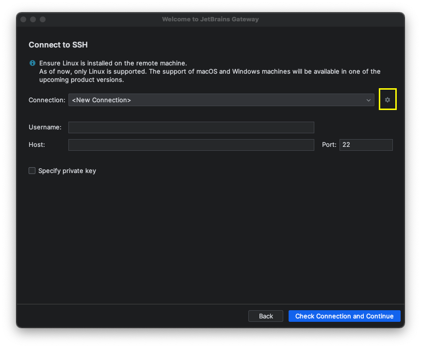
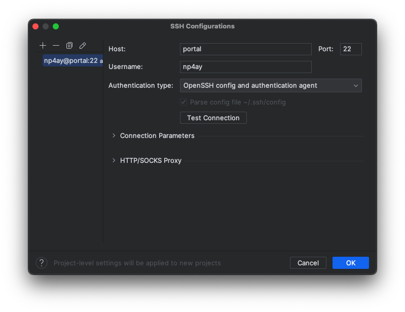
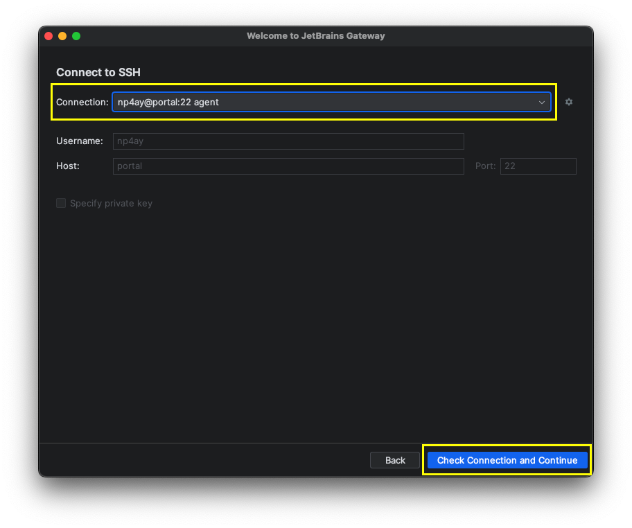
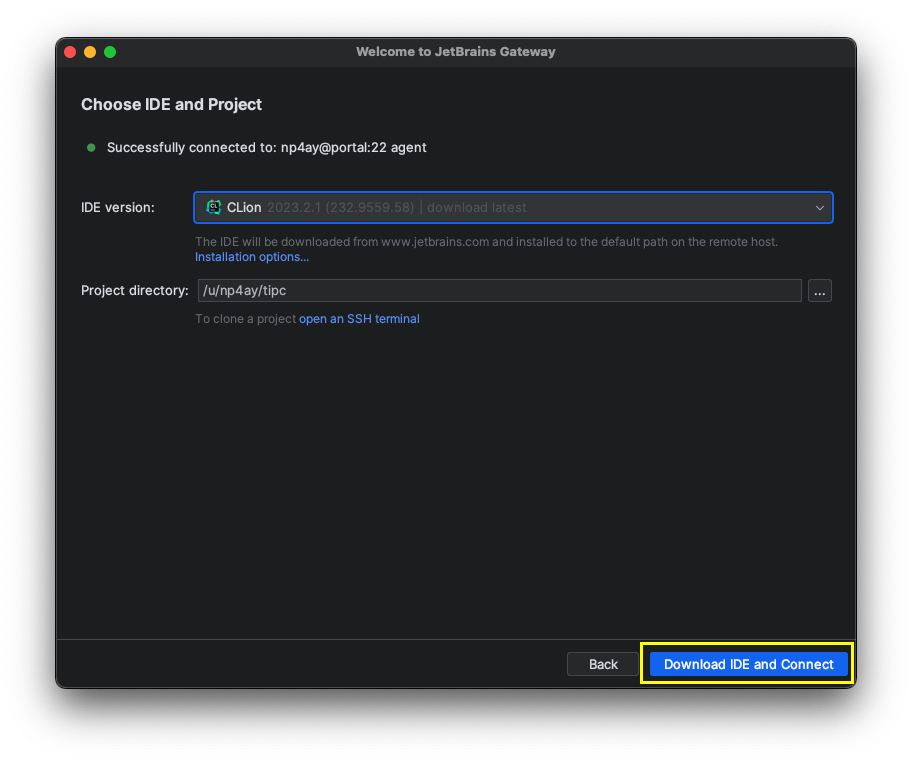
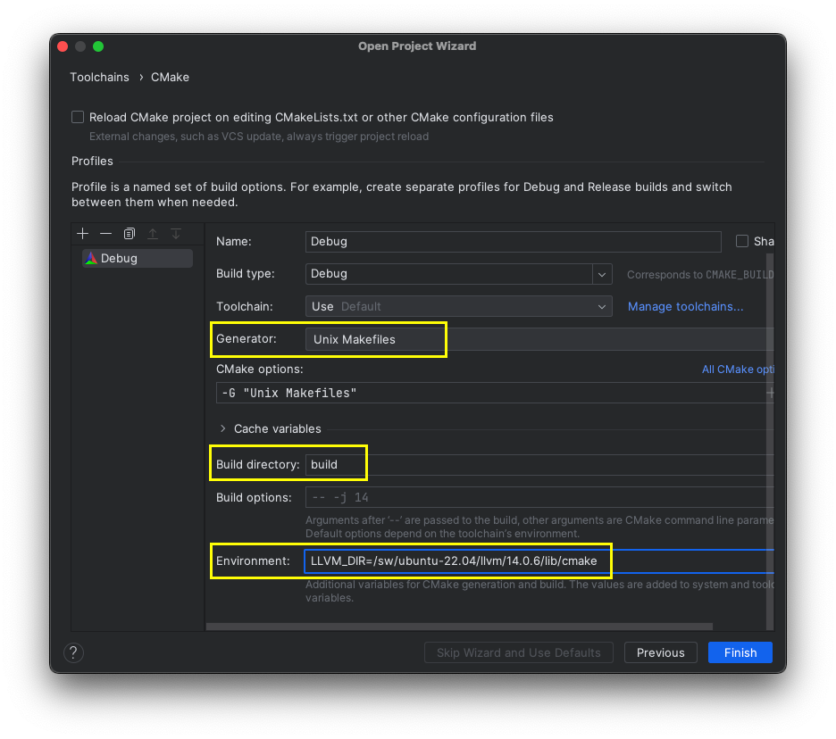
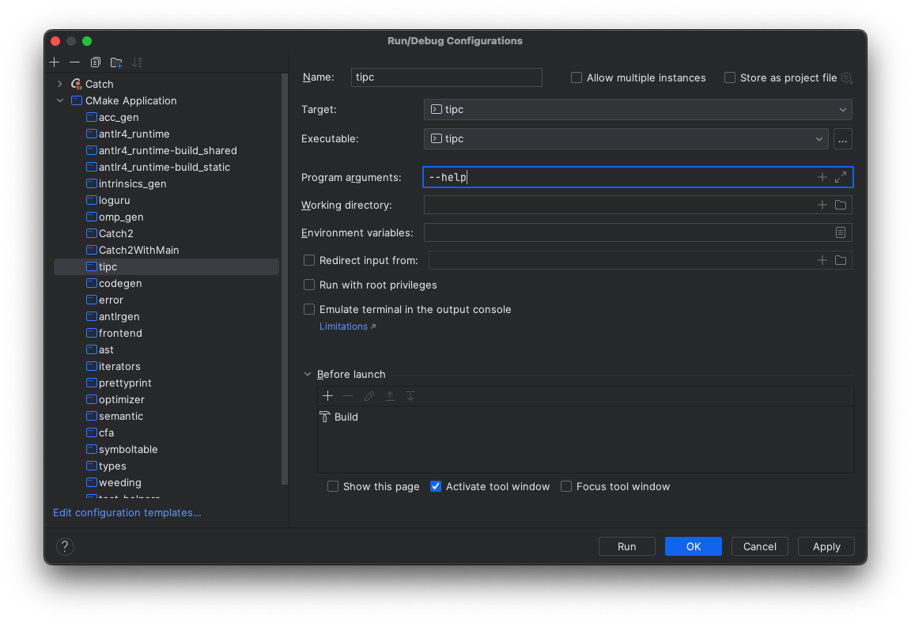

# Developing on UVA hardware
You can develop `tipc` on servers hosted by the CS department (e.g., portal,
granger). The file system shared by these machines includes all of the required
dependencies. For a familiar IDE experience, we can leverage JetBrains support
for remote development. The following instructions describe how to install and
configure the JetBrains thin client for `tipc` development on UVA hosted
hardware.

## Configuring SSH
First, let us configure password-less logins to the server. In the following
instructions we will use the [portal cluster][1].  

We will use ssh keys instead of a username/password combination. Generate an
SSH key for portal connections.

```bash
cd ~/.ssh  # Create this directory if it does not exist.
ssh-keygen -t ed25519 -b 4096
```

When prompted, choose a filename for your keys and leave the passphrase field
empty.  

Next, copy the public key you just created to the remote server. 
```bash
ssh-copy-id -i ~/.ssh/<keyname> <computingID>@portal.cs.virginia.edu
```

When prompted, provide your UVA CS password.  

Once complete you should be able to ssh to the portal cluster without a password.  
```bash
ssh -i ~/.ssh/<keyname> <computingID>@portal.cs.virginia.edu
```

You can simplify the login experience with an [`ssh` config file][2]. In the
`~/.ssh` directory create a file named `config`, and add an entry that looks
like,
```
Host portal
  User <computingID>
  HostName portal.cs.virginia.edu
  IdentityFile ~/.ssh/uva/<keyname>
```

Now, you can login with `ssh portal`.

## Cloning tipc
From `portal`, clone `tipc`.

```bash
git clone https://github.com/matthewbdwyer/tipc.git
```

## Configuring the Remote environment.
You can configure your environment on `portal` by loading and unloading
[modules][3]. The `tipc` project includes [modulefiles][4] to help configure
the environment. The modulefiles are in the `conf` directory.  

You can load the tipc module with the following command.
```bash
module load ~/tipc/conf/modulefiles/tipc/F23
```

Please note that there is an assumption in the stock modulefile that `tipc` is
cloned to your home directory. If that assumption does not hold true, update
the `topdir` variable in `conf/modules/tipc/F23` to the actual location of the
`tipc` repository.  

To confirm the module was successfully loaded check the value of the `TIPCLANG`
environment variable.  
```bash
echo $TIPCLANG
# /sw/ubuntu-22.04/llvm/14.0.6/bin/clang-14
```

To load the `tipc` environment every time you ssh to portal, add the `module
load` command to your `bashrc`.
```bash
echo 'module load ~/tipc/conf/modulefiles/tipc/F23' >> ~/.bashrc
```

## Building tipc from the Command Line.
At this point you should be fully equipped to build tipc on portal from the command line.

From the `tipc` project directory,
```bash
mkdir build
cd build
cmake ..
make -j4
```

## Using the JetBrains thin client
You may prefer to develop with an IDE. In that case you can use the [JetBrains
Gateway and thin client][6]. In this setup the IDE runs entirely on the server.
You connect to the IDE from a thin client on your local machine over SSH.  

[JetBrains Gateway][5] can be installed as a standalone app. It also comes part
of any JetBrains IDE distribution. That is, if you have CLion installed
already, you need not install the gateway. The instructions will continue with
the JetBrains Gateway standalone app but are nearly identical, and have been
tested with CLion.  

First, launch the JetBrains Gateway application. From the "All Providers" page
select "New Connection" under "SSH Connection".


From the "Connect to SSH" page, select the gear icon next to the "Connection"
drop down.



Select the "+" icon on the "SSH Configurations" page. Fill out the information
as done in the screenshot below. Note the "Host" field should match the name of
the entry in your ssh config. We chose the name, "portal", in our initial
setup.   



If preferred, you can prevent the connection from being dropped for inactivity. Under "Connection Parameters" check the "Send keep-alive messages..." box.  

Select "Test Connection" to verify you can establish a connection.  


Select "Ok" on the "SSH Configurations" page and return to the "Connect to SSH"
page. In the "Connection" drop down select the connection you just created.
Select "Check Connection and Continue".  



You will then be prompted to "Choose IDE and Project". For the "IDE version",
choose "CLion". For the "Project directory" choose the `tipc` repository we
previously cloned to your home directory. Select "Download IDE and Connect"



This process may take several minutes. Once complete, `tipc` should appear as
an SSH project running on "portal". Select the project to open it.


The `tipc` project will open in the JetBrains client.  

The IDE running on portal (that you are connected to) does not source the
`bashrc` file as your shell does. As such, we need to configure your build
environment within CLion.  

From the "Project Wizard" popup accept the default toolchain by pressing "Next".  

Update the default CMake profile on the following page. Set the "Generator" to
"Unix Makefiles", the "Build directory" to `build`, and the "Environment" to
`LLVM_DIR=/sw/ubuntu-22.04/llvm/14.0.6/lib/cmake`. Select "Finish".    



Note, if the "Project Wizard" does not appear, you can reach the same
configuration page from the CLion settings. From the settings, navigate to
"Build, Execution, Deployment" in the side menu, and then to "CMake". From here
you can configure the default profile appropriately.  

Once complete, CLion will index your files and construct build configurations.  

## Running tipc from CLion
You should now be able to run and debug tipc with the "play" and "debug" icons respectively.  


You can pass arguments to `tipc` just as you do on the command line by editing
the Run/Debug configuration.  


The screenshot below shows how you can pass the `--help` flag as one of the
"Program arguments".  




[1]: https://www.cs.virginia.edu/wiki/doku.php?id=compute_portal
[2]: https://www.ssh.com/academy/ssh/config
[3]: https://www.cs.virginia.edu/wiki/doku.php?id=linux_environment_modules
[4]: https://modules.readthedocs.io/en/stable/modulefile.html
[5]: https://www.jetbrains.com/remote-development/gateway/
[6]: https://www.jetbrains.com/help/clion/remote-development-a.html
